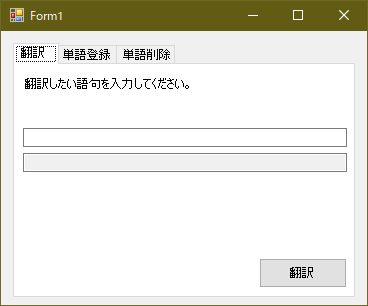
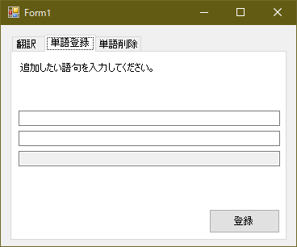
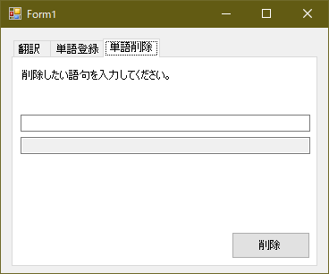

:toc: left
:source-highlighter: coderay
:experimental:

== Chapter Extended 1-5 クライアント側コーディング例]

=== プロジェクトの作成

Visual Studio を起動し、Windows Forms の新規プロジェクトを作成して下さい。
また、System.Web も参照に加えて下さい。

=== ライブラリの追加

ホームページからlink:https://thrift.apache.org/download[ダウンロード]アーカイブをダウンロードし、
lib/csharp/src の内容をプロジェクトにコピーします。
その際、ディレクトリはThriftとして下さい。
また、propertiesフォルダ、csproj, sln ファイルは削除しておいて下さい。

=== 画面の設計

以下のように、画面にコントロールを配置します。

=== 各ボタンイベントのコーディング

翻訳、登録、削除ボタンを押下したときのイベントをコーディングします。
IDLを利用して定義したサービスを呼び出すようにします。

[source,c++]
.Form1.cs
----
include::../projects/chapterExtended1-client/WindowsFormsApp1/Form1.cs[]
----

=== End of contents

追加のチャプターを含めて、これでこのテキストは全て完了です。
ここまでお付き合いいただき、ありがとうございました。

=== リンク

* link:chapterExtended1-1.html[Chapter Extended 1-1 C#(Windows Forms)からサービスを利用する]
* link:chapterExtended1-2.html[Chapter Extended 1-2 概要]
* link:chapterExtended1-3.html[Chapter Extended 1-3 IDLの定義とコード生成]
* link:chapterExtended1-4.html[Chapter Extended 1-4 サーバー側コーディング例]
* link:chapterExtended1-5.html[Chapter Extended 1-5 クライアント側コーディング例]
